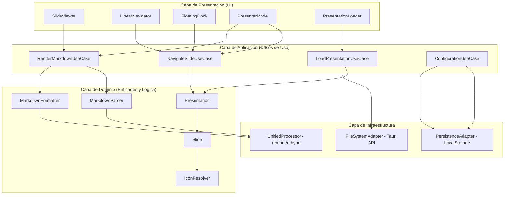
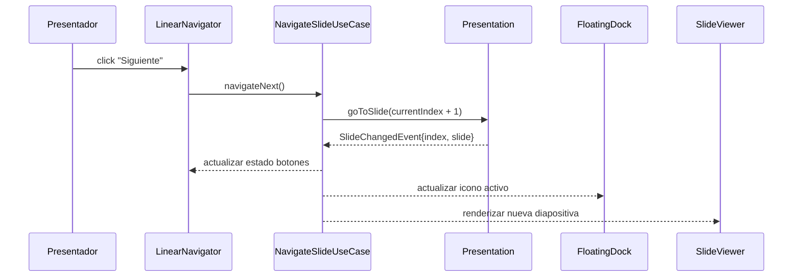
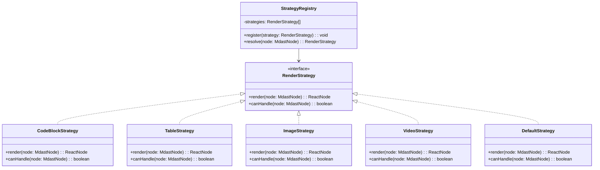

# Documento de Diseño: Markdown Presenter Pro (MPP)

## Visión General

Markdown Presenter Pro (MPP) es una aplicación de escritorio multiplataforma que transforma archivos Markdown en presentaciones interactivas y profesionales. La arquitectura sigue los principios de Clean Architecture con separación estricta entre capas de dominio, aplicación y presentación. El frontend se construye con React + TypeScript empaquetado mediante Tauri 2.0 para distribución nativa en Windows, macOS y Linux. El procesamiento de Markdown se realiza mediante el ecosistema Unified.js (remark/rehype), y la interfaz utiliza Tailwind CSS con Framer Motion para animaciones fluidas, incluyendo el efecto de magnificación tipo Dock de macOS.

### Decisiones Arquitectónicas Clave

| Decisión                | Elección                     | Justificación                                                                                                            |
| ----------------------- | ---------------------------- | ------------------------------------------------------------------------------------------------------------------------ |
| Framework de escritorio | Tauri 2.0                    | Binarios 90-97% más pequeños que Electron, menor consumo de memoria, backend en Rust para operaciones de archivo seguras |
| Framework UI            | React + TypeScript           | Ecosistema maduro, gestión de estado compleja, tipado fuerte para SOLID/OOP                                              |
| Procesamiento Markdown  | Unified.js (remark + rehype) | Estándar de la industria para transformación Markdown→AST→HTML, extensible con plugins                                   |
| Animaciones             | Framer Motion                | API declarativa para el efecto de magnificación del Dock, transiciones a 60fps                                           |
| Estilos                 | Tailwind CSS                 | Diseño utilitario rápido, consistencia visual, purge para producción                                                     |
| Contenedorización       | Docker multi-stage           | Reproducibilidad del entorno, CI/CD automatizado, imágenes optimizadas                                                   |

## Arquitectura

### Diagrama de Arquitectura de Alto Nivel



### Patrón Observer: Notificación de Cambio de Diapositiva



### Patrón Strategy: Renderizado de Elementos



## Componentes e Interfaces

### Capa de Dominio

#### Entidad: `Presentation`

Representa una colección ordenada de diapositivas con estado de navegación.

```typescript
interface ISlideObserver {
  onSlideChanged(event: SlideChangedEvent): void;
}

interface SlideChangedEvent {
  previousIndex: number;
  currentIndex: number;
  slide: Slide;
  totalSlides: number;
}

class Presentation {
  private slides: Slide[];
  private currentIndex: number;
  private observers: Set<ISlideObserver>;

  constructor(slides: Slide[]);

  // Navegación
  goToSlide(index: number): SlideChangedEvent;
  next(): SlideChangedEvent | null;
  previous(): SlideChangedEvent | null;

  // Consultas
  getCurrentSlide(): Slide;
  getSlideAt(index: number): Slide;
  getCurrentIndex(): number;
  getTotalSlides(): number;
  isFirstSlide(): boolean;
  isLastSlide(): boolean;

  // Observer
  addObserver(observer: ISlideObserver): void;
  removeObserver(observer: ISlideObserver): void;
  private notifyObservers(event: SlideChangedEvent): void;
}
```

#### Entidad: `Slide`

Unidad de contenido dentro de una presentación.

```typescript
type SlideContentType = "code" | "image" | "text" | "table" | "mixed";

interface SlideMetadata {
  icon?: string; // Ruta a SVG personalizado o nombre de icono
  title: string; // Extraído del primer heading o nombre de archivo
  contentType: SlideContentType;
  sourceFile: string; // Archivo .md de origen
}

class Slide {
  readonly id: string;
  readonly rawMarkdown: string;
  readonly metadata: SlideMetadata;
  private cachedHtml: string | null;

  constructor(rawMarkdown: string, metadata: SlideMetadata);

  getRawMarkdown(): string;
  getMetadata(): SlideMetadata;
  getCachedHtml(): string | null;
  setCachedHtml(html: string): void;
}
```

#### Servicio: `MarkdownParser`

Parsea Markdown a AST y formatea AST de vuelta a Markdown (round-trip).

```typescript
import type { Root as MdastRoot } from "mdast";

interface IMarkdownParser {
  parse(markdown: string): MdastRoot;
  format(ast: MdastRoot): string;
  toHtml(markdown: string): string;
}

class MarkdownParser implements IMarkdownParser {
  private processor: unified.Processor;
  private htmlProcessor: unified.Processor;

  constructor();

  // Parseo: Markdown → AST (mdast)
  parse(markdown: string): MdastRoot;

  // Formateo: AST (mdast) → Markdown
  format(ast: MdastRoot): string;

  // Renderizado: Markdown → HTML
  toHtml(markdown: string): string;
}
```

#### Servicio: `IconResolver`

Resuelve el icono apropiado para cada diapositiva.

```typescript
interface IIconResolver {
  resolve(metadata: SlideMetadata): IconResult;
  loadCustomSvg(path: string): Promise<IconResult>;
}

interface IconResult {
  type: "custom-svg" | "default";
  content: string; // SVG string o nombre de icono predeterminado
  fallback: boolean; // true si se usó icono de respaldo
  warning?: string; // Mensaje si hubo error al cargar SVG personalizado
}

class IconResolver implements IIconResolver {
  private defaultIcons: Map<SlideContentType, string>;

  resolve(metadata: SlideMetadata): IconResult;
  loadCustomSvg(path: string): Promise<IconResult>;
}
```

### Capa de Aplicación (Casos de Uso)

#### `LoadPresentationUseCase`

```typescript
interface LoadPresentationInput {
  path: string;
  type: 'file' | 'directory';
}

interface LoadPresentationResult {
  success: boolean;
  presentation?: Presentation;
  error?: string;
}

class LoadPresentationUseCase {
  constructor(
    private fileSystem: IFileSystemAdapter,
    private parser: IMarkdownParser,
    private iconResolver: IIconResolver
  );

  async execute(input: LoadPresentationInput): Promise<LoadPresentationResult>;

  // Archivo individual: divide por secciones (headings h1/h2 o separadores ---)
  private splitIntoSlides(markdown: string, sourceFile: string): Slide[];

  // Carpeta: cada .md es una diapositiva, ordenados alfabéticamente
  private async loadDirectory(dirPath: string): Promise<Slide[]>;

  // Detecta el tipo de contenido predominante
  private detectContentType(markdown: string): SlideContentType;
}
```

#### `NavigateSlideUseCase`

```typescript
class NavigateSlideUseCase {
  constructor(private presentation: Presentation);

  next(): SlideChangedEvent | null;
  previous(): SlideChangedEvent | null;
  goTo(index: number): SlideChangedEvent;
  getNavigationState(): NavigationState;
}

interface NavigationState {
  currentIndex: number;
  totalSlides: number;
  canGoNext: boolean;
  canGoPrevious: boolean;
  currentSlide: Slide;
}
```

#### `RenderMarkdownUseCase`

```typescript
class RenderMarkdownUseCase {
  constructor(
    private parser: IMarkdownParser,
    private strategyRegistry: StrategyRegistry
  );

  render(slide: Slide): RenderedSlide;
  renderToHtml(markdown: string): string;
}

interface RenderedSlide {
  html: string;
  renderTimeMs: number;
}
```

### Capa de Presentación (Componentes React)

#### `FloatingDock` — Menú Flotante con Magnificación

```typescript
interface DockProps {
  slides: SlideMetadata[];
  activeIndex: number;
  position: DockPosition;
  onSlideSelect: (index: number) => void;
}

type DockPosition = "top" | "bottom" | "left" | "right";

// Algoritmo de magnificación usando Framer Motion MotionValues
// Cada icono calcula su distancia al cursor y escala proporcionalmente
// Basado en el patrón de buildui.com/recipes/magnified-dock
const FloatingDock: React.FC<DockProps>;
```

#### `DockIcon` — Icono Individual con Magnificación

```typescript
interface DockIconProps {
  icon: IconResult;
  mouseX: MotionValue<number>; // Posición X del mouse (Framer Motion)
  isActive: boolean;
  onClick: () => void;
}

// Cada icono usa useTransform para derivar su escala
// basada en la distancia al cursor del mouse
const DockIcon: React.FC<DockIconProps>;
```

#### `SlideViewer` — Visualizador de Diapositiva

```typescript
interface SlideViewerProps {
  slide: Slide;
  renderedHtml: string;
}

const SlideViewer: React.FC<SlideViewerProps>;
```

#### `PresenterMode` — Modo Presentador

```typescript
interface PresenterModeProps {
  presentation: Presentation;
  isActive: boolean;
  onDeactivate: () => void;
}

// Vista dividida: diapositiva actual + preview siguiente + cronómetro + "N de M"
const PresenterMode: React.FC<PresenterModeProps>;
```

### Capa de Infraestructura

#### `IFileSystemAdapter`

```typescript
interface IFileSystemAdapter {
  readFile(path: string): Promise<string>;
  readDirectory(path: string): Promise<FileEntry[]>;
  exists(path: string): Promise<boolean>;
}

interface FileEntry {
  name: string;
  path: string;
  isDirectory: boolean;
  extension: string;
}

// Implementación con Tauri API (@tauri-apps/plugin-fs)
class TauriFileSystemAdapter implements IFileSystemAdapter { ... }
```

#### `IPersistenceAdapter`

```typescript
interface IPersistenceAdapter {
  get<T>(key: string): T | null;
  set<T>(key: string, value: T): void;
  remove(key: string): void;
}

// Implementación con localStorage o Tauri Store plugin
class LocalPersistenceAdapter implements IPersistenceAdapter { ... }
```

### Patrón Strategy: Registro de Estrategias de Renderizado

```typescript
class StrategyRegistry {
  private strategies: RenderStrategy[] = [];

  register(strategy: RenderStrategy): void;

  // Retorna la primera estrategia que puede manejar el nodo
  resolve(node: MdastNode): RenderStrategy;
}

// Inicialización del registro
function createDefaultRegistry(): StrategyRegistry {
  const registry = new StrategyRegistry();
  registry.register(new CodeBlockStrategy()); // Bloques de código con syntax highlighting
  registry.register(new TableStrategy()); // Tablas GFM
  registry.register(new ImageStrategy()); // Imágenes locales/remotas
  registry.register(new VideoStrategy()); // Videos embebidos
  registry.register(new DefaultStrategy()); // Fallback: renderizado HTML estándar
  return registry;
}
```

## Modelos de Datos

### Estado Global de la Aplicación

```typescript
interface AppState {
  presentation: PresentationState | null;
  dock: DockState;
  presenterMode: PresenterModeState;
  ui: UIState;
}

interface PresentationState {
  slides: Slide[];
  currentIndex: number;
  totalSlides: number;
  sourcePath: string;
  sourceType: "file" | "directory";
}

interface DockState {
  position: DockPosition;
  icons: IconResult[];
  activeIndex: number;
}

interface PresenterModeState {
  isActive: boolean;
  startTime: number | null; // timestamp de activación
  elapsedSeconds: number;
}

interface UIState {
  isFullscreen: boolean;
  theme: "light" | "dark";
}
```

### Modelo AST de Markdown (mdast)

El procesamiento de Markdown utiliza el estándar [mdast](https://github.com/syntax-tree/mdast) del ecosistema Unified.js:

```typescript
// Tipos principales del AST (de @types/mdast)
import type {
  Root, // Nodo raíz del documento
  Heading, // Encabezados h1-h6
  Paragraph, // Párrafos
  Code, // Bloques de código
  Table, // Tablas GFM
  Image, // Imágenes
  List, // Listas
  ListItem, // Elementos de lista
  Text, // Texto plano
  InlineCode, // Código inline
  Link, // Enlaces
} from "mdast";
```

### Pipeline de Procesamiento Unified.js

```typescript
// Pipeline de parseo: Markdown → AST (mdast)
const parseProcessor = unified()
  .use(remarkParse) // Markdown → mdast
  .use(remarkGfm) // Soporte GFM (tablas, tareas, tachado)
  .use(remarkFrontmatter); // Soporte frontmatter (metadatos de diapositiva)

// Pipeline de renderizado: Markdown → HTML
const renderProcessor = unified()
  .use(remarkParse)
  .use(remarkGfm)
  .use(remarkFrontmatter)
  .use(remarkRehype, { allowDangerousHtml: true }) // mdast → hast
  .use(rehypeHighlight) // Syntax highlighting para bloques de código
  .use(rehypeStringify); // hast → HTML string

// Pipeline de formateo: AST (mdast) → Markdown
const formatProcessor = unified()
  .use(remarkStringify, {
    // mdast → Markdown string
    bullet: "-",
    emphasis: "_",
    strong: "*",
  })
  .use(remarkGfm);
```

### Modelo de Configuración Persistente

```typescript
interface UserConfiguration {
  dockPosition: DockPosition;
  theme: "light" | "dark";
  recentFiles: RecentFile[];
  keyboardShortcuts: KeyboardShortcutMap;
}

interface RecentFile {
  path: string;
  type: "file" | "directory";
  lastOpened: string; // ISO 8601
  title: string;
}

interface KeyboardShortcutMap {
  nextSlide: string[]; // ['ArrowRight', 'Space']
  previousSlide: string[]; // ['ArrowLeft']
  togglePresenterMode: string[]; // ['p']
  toggleFullscreen: string[]; // ['f', 'F11']
  exitPresentation: string[]; // ['Escape']
}
```

### Modelo de Separación de Diapositivas

Las diapositivas se extraen de archivos Markdown mediante dos estrategias:

```typescript
// Estrategia 1: Archivo individual → dividir por separadores
// Separadores soportados: '---' (hr), headings h1/h2
interface SlideSplitRule {
  type: "horizontal-rule" | "heading";
  headingDepth?: 1 | 2; // Solo para tipo 'heading'
}

// Estrategia 2: Carpeta → cada archivo .md es una diapositiva
// Orden: alfabético por nombre de archivo
// Archivos no-.md son ignorados

// Algoritmo de detección de tipo de contenido
function detectContentType(ast: MdastRoot): SlideContentType {
  // Cuenta nodos por tipo en el AST
  // Retorna el tipo predominante:
  // - 'code' si >50% son bloques de código
  // - 'image' si contiene imágenes como elemento principal
  // - 'table' si contiene tablas como elemento principal
  // - 'text' si es mayoritariamente texto/párrafos
  // - 'mixed' si no hay tipo predominante claro
}
```

### Estructura Docker y CI/CD

```yaml
# docker-compose.yml (modelo conceptual)
services:
  app:
    build:
      context: .
      dockerfile: Dockerfile
      target: development
    volumes:
      - .:/app
      - /app/node_modules
    ports:
      - "3000:3000"

  docs:
    build:
      context: .
      dockerfile: Dockerfile.docs
    ports:
      - "3001:3001"
```

```dockerfile
# Dockerfile multi-stage (modelo conceptual)
# Stage 1: Dependencias
FROM node:20-alpine AS deps
WORKDIR /app
COPY package*.json ./
RUN npm ci

# Stage 2: Desarrollo
FROM node:20-alpine AS development
WORKDIR /app
COPY --from=deps /app/node_modules ./node_modules
COPY . .
CMD ["npm", "run", "dev"]

# Stage 3: Build
FROM node:20-alpine AS build
WORKDIR /app
COPY --from=deps /app/node_modules ./node_modules
COPY . .
RUN npm run build

# Stage 4: Producción (solo artefactos)
FROM node:20-alpine AS production
WORKDIR /app
COPY --from=build /app/dist ./dist
COPY --from=build /app/package*.json ./
RUN npm ci --production
CMD ["npm", "start"]
```

## Propiedades de Correctitud

_Una propiedad es una característica o comportamiento que debe mantenerse verdadero en todas las ejecuciones válidas de un sistema — esencialmente, una declaración formal sobre lo que el sistema debe hacer. Las propiedades sirven como puente entre especificaciones legibles por humanos y garantías de correctitud verificables por máquinas._

### Propiedad 1: Round-trip de parseo Markdown (incluyendo GFM)

_Para cualquier_ archivo Markdown válido (incluyendo extensiones GFM como tablas, listas de tareas y tachado), parsear el contenido a AST, formatear el AST de vuelta a texto Markdown y volver a parsear a AST SHALL producir un AST equivalente al original.

**Valida: Requerimientos 9.1, 9.2, 9.3, 9.4**

### Propiedad 2: Correspondencia estructural HTML del renderizado Markdown

_Para cualquier_ documento Markdown válido (CommonMark y GFM), el HTML generado por el renderizador SHALL contener los elementos HTML correspondientes a cada nodo del AST: headings producen etiquetas `<h1>`-`<h6>`, párrafos producen `<p>`, tablas GFM producen `<table>`, y listas de tareas producen checkboxes.

**Valida: Requerimientos 1.1, 1.2**

### Propiedad 3: Determinación de resaltado de sintaxis en bloques de código

_Para cualquier_ bloque de código en un documento Markdown, si el bloque especifica un indicador de lenguaje, el HTML resultante SHALL contener clases CSS de resaltado de sintaxis específicas para ese lenguaje; si el bloque no especifica indicador de lenguaje, el HTML resultante SHALL ser un elemento `<pre><code>` sin clases de resaltado.

**Valida: Requerimientos 1.5, 1.6**

### Propiedad 4: Resiliencia del parser ante entrada malformada

_Para cualquier_ cadena de texto arbitraria (incluyendo Markdown inválido, texto aleatorio y cadenas vacías), el parser SHALL producir una salida sin lanzar excepciones, y las secciones válidas del documento SHALL renderizarse correctamente.

**Valida: Requerimiento 1.7**

### Propiedad 5: Correctitud del estado de navegación

_Para cualquier_ presentación con N diapositivas y un índice actual i, invocar `next()` cuando i < N-1 SHALL producir índice i+1, invocar `previous()` cuando i > 0 SHALL producir índice i-1, e invocar `goTo(j)` para cualquier j válido (0 ≤ j < N) SHALL producir índice j. En los límites (i=0 para previous, i=N-1 para next), la operación SHALL retornar null sin modificar el índice.

**Valida: Requerimientos 2.1, 2.2, 2.3, 2.4, 3.2**

### Propiedad 6: Invariante de notificación del Observer

_Para cualquier_ secuencia de acciones de navegación sobre una presentación con observadores registrados, cada observador SHALL recibir un `SlideChangedEvent` con el índice correcto después de cada cambio de diapositiva, y el `activeIndex` del Dock SHALL ser igual al `currentIndex` de la presentación en todo momento.

**Valida: Requerimientos 2.6, 3.3**

### Propiedad 7: Invariante de cantidad de iconos del Dock

_Para cualquier_ presentación con N diapositivas, el Dock SHALL mostrar exactamente N iconos, uno por cada diapositiva.

**Valida: Requerimiento 3.1**

### Propiedad 8: Round-trip de persistencia de posición del Dock

_Para cualquier_ posición válida del Dock (`top`, `bottom`, `left`, `right`), guardar la posición en el almacenamiento persistente y luego cargarla SHALL retornar la misma posición.

**Valida: Requerimiento 4.3**

### Propiedad 9: Correctitud del algoritmo de magnificación

_Para cualquier_ arreglo de iconos y posición del cursor, la escala calculada por el Motor de Magnificación SHALL ser máxima en el icono más cercano al cursor, SHALL decrecer monótonamente con la distancia al cursor, SHALL mantener el orden relativo de los iconos, y SHALL estar dentro de los límites [tamaño_base, tamaño_máximo].

**Valida: Requerimientos 5.1, 5.2, 5.4**

### Propiedad 10: Correctitud de la resolución de iconos

_Para cualquier_ diapositiva, si los metadatos especifican un icono personalizado válido, el resolver SHALL retornar un resultado de tipo `custom-svg`; si no se especifica icono, SHALL retornar un icono predeterminado correspondiente al `SlideContentType`; si el icono personalizado es inválido, SHALL retornar un icono de respaldo con `fallback=true` y un mensaje de advertencia.

**Valida: Requerimientos 6.1, 6.2, 6.4**

### Propiedad 11: Correctitud de la división de diapositivas desde archivo

_Para cualquier_ archivo Markdown con N separadores de sección (reglas horizontales `---` o headings h1/h2), la función de división SHALL producir exactamente N+1 diapositivas (o N si el archivo comienza con un separador), y cada diapositiva SHALL contener el contenido Markdown correspondiente a su sección.

**Valida: Requerimiento 7.1**

### Propiedad 12: Filtrado y ordenamiento de archivos en directorio

_Para cualquier_ directorio que contenga una mezcla de archivos con diversas extensiones, el cargador de presentaciones SHALL incluir únicamente los archivos con extensión `.md`, y las diapositivas resultantes SHALL estar ordenadas alfabéticamente por nombre de archivo.

**Valida: Requerimientos 7.2, 7.3**

### Propiedad 13: Preservación del índice al alternar Modo Presentador

_Para cualquier_ presentación en cualquier índice de diapositiva, activar y luego desactivar el Modo Presentador SHALL preservar el índice de la diapositiva actual sin modificaciones.

**Valida: Requerimiento 8.5**

### Propiedad 14: Formato del contador de diapositivas

_Para cualquier_ presentación con `totalSlides` diapositivas y un `currentIndex`, el texto formateado del contador SHALL ser exactamente `"{currentIndex + 1} de {totalSlides}"`.

**Valida: Requerimiento 8.3**

## Manejo de Errores

### Estrategia General

El manejo de errores sigue el principio de degradación elegante: la aplicación debe continuar funcionando incluso cuando componentes individuales encuentran problemas. Los errores se clasifican en tres niveles:

| Nivel       | Comportamiento               | Ejemplo                          |
| ----------- | ---------------------------- | -------------------------------- |
| Recuperable | Mostrar fallback y continuar | SVG inválido → icono genérico    |
| Informativo | Mostrar mensaje al usuario   | Carpeta sin archivos .md         |
| Fatal       | Mostrar pantalla de error    | Fallo de inicialización de Tauri |

### Errores por Componente

#### Renderizador Markdown (`MarkdownParser`)

| Escenario                                  | Comportamiento                                                                      |
| ------------------------------------------ | ----------------------------------------------------------------------------------- |
| Markdown malformado                        | Renderizar secciones inválidas como texto plano, continuar con el resto del archivo |
| Imagen local no encontrada                 | Mostrar placeholder con texto alternativo del Markdown                              |
| Video no reproducible                      | Mostrar enlace al recurso con mensaje informativo                                   |
| Bloque de código con lenguaje no soportado | Renderizar como texto monoespaciado sin resaltado                                   |

```typescript
class MarkdownRenderError extends Error {
  constructor(
    message: string,
    public readonly section: string, // Sección del Markdown que falló
    public readonly fallbackHtml: string // HTML de respaldo generado
  ) {
    super(message);
  }
}
```

#### Gestor de Presentaciones (`LoadPresentationUseCase`)

| Escenario                                      | Comportamiento                                                               |
| ---------------------------------------------- | ---------------------------------------------------------------------------- |
| Archivo .md vacío                              | Retornar `LoadPresentationResult` con `success: false` y mensaje descriptivo |
| Carpeta sin archivos .md                       | Retornar `LoadPresentationResult` con `success: false` y mensaje descriptivo |
| Archivo no accesible (permisos)                | Retornar error con ruta del archivo y tipo de error de permisos              |
| Carpeta con archivos .md parcialmente legibles | Cargar los archivos accesibles, registrar advertencias para los inaccesibles |

```typescript
type PresentationError =
  | { type: "empty_file"; path: string }
  | { type: "no_markdown_files"; path: string }
  | { type: "permission_denied"; path: string }
  | { type: "file_not_found"; path: string }
  | { type: "partial_load"; loadedCount: number; failedPaths: string[] };
```

#### Sistema de Iconos (`IconResolver`)

| Escenario                       | Comportamiento                                                                 |
| ------------------------------- | ------------------------------------------------------------------------------ |
| SVG personalizado inválido      | Retornar icono genérico con `fallback: true` y `warning` con detalle del error |
| SVG personalizado no encontrado | Retornar icono genérico con `fallback: true`                                   |
| Tipo de contenido no reconocido | Asignar icono genérico de documento                                            |

#### Persistencia (`LocalPersistenceAdapter`)

| Escenario                  | Comportamiento                                                 |
| -------------------------- | -------------------------------------------------------------- |
| localStorage no disponible | Usar valores predeterminados en memoria, registrar advertencia |
| Datos corruptos en storage | Resetear a valores predeterminados, registrar advertencia      |
| Cuota de storage excedida  | Continuar sin persistir, notificar al usuario                  |

#### Navegación (`Presentation`)

| Escenario                               | Comportamiento                              |
| --------------------------------------- | ------------------------------------------- |
| `next()` en última diapositiva          | Retornar `null`, no modificar estado        |
| `previous()` en primera diapositiva     | Retornar `null`, no modificar estado        |
| `goTo(index)` con índice fuera de rango | Lanzar `RangeError` con mensaje descriptivo |

### Límites de Error en React

```typescript
// ErrorBoundary para capturar errores de renderizado en componentes
class SlideErrorBoundary extends React.Component<Props, State> {
  static getDerivedStateFromError(error: Error): State;
  componentDidCatch(error: Error, errorInfo: React.ErrorInfo): void;
  // Renderiza un mensaje amigable si un componente de diapositiva falla
  render(): ReactNode;
}
```

## Estrategia de Pruebas

### Enfoque Dual: Pruebas Unitarias + Pruebas Basadas en Propiedades

La estrategia de pruebas combina dos enfoques complementarios:

1. **Pruebas unitarias (example-based)**: Verifican comportamientos específicos con ejemplos concretos, casos borde y condiciones de error.
2. **Pruebas basadas en propiedades (property-based)**: Verifican propiedades universales que deben cumplirse para todas las entradas válidas, usando generación aleatoria de datos.

### Biblioteca de Pruebas Basadas en Propiedades

- **Biblioteca**: [fast-check](https://github.com/dubzzz/fast-check) — la biblioteca PBT más madura para TypeScript/JavaScript
- **Framework de pruebas**: Vitest (compatible con el ecosistema Vite/React)
- **Configuración mínima**: 100 iteraciones por propiedad (`numRuns: 100`)

### Mapeo de Propiedades a Pruebas

| Propiedad                     | Tipo de Prueba | Generadores Necesarios                                          |
| ----------------------------- | -------------- | --------------------------------------------------------------- |
| P1: Round-trip Markdown       | Property-based | Generador de documentos Markdown válidos (CommonMark + GFM)     |
| P2: Correspondencia HTML      | Property-based | Generador de documentos Markdown con elementos variados         |
| P3: Resaltado de código       | Property-based | Generador de bloques de código con/sin indicador de lenguaje    |
| P4: Resiliencia del parser    | Property-based | `fc.string()`, `fc.unicodeString()`, cadenas arbitrarias        |
| P5: Estado de navegación      | Property-based | Generador de presentaciones (N slides) + secuencias de acciones |
| P6: Observer notification     | Property-based | Generador de secuencias de navegación + mock observers          |
| P7: Cantidad de iconos        | Property-based | Generador de presentaciones con N slides variable               |
| P8: Persistencia Dock         | Property-based | `fc.constantFrom('top', 'bottom', 'left', 'right')`             |
| P9: Magnificación             | Property-based | Generador de posiciones de iconos + posiciones de cursor        |
| P10: Resolución de iconos     | Property-based | Generador de `SlideMetadata` con/sin icono personalizado        |
| P11: División de diapositivas | Property-based | Generador de Markdown con separadores variables                 |
| P12: Filtrado directorio      | Property-based | Generador de listas de archivos con extensiones mixtas          |
| P13: Preservación índice      | Property-based | Generador de presentaciones + índices aleatorios                |
| P14: Formato contador         | Property-based | `fc.nat()` para currentIndex y totalSlides                      |

### Formato de Etiquetado de Pruebas de Propiedades

Cada prueba basada en propiedades debe incluir un comentario de etiqueta:

```typescript
// Feature: markdown-presenter-pro, Property 1: Round-trip de parseo Markdown
it.prop([markdownArb], { numRuns: 100 })(
  "parse(format(parse(md))) ≡ parse(md)",
  (markdown) => {
    const ast1 = parser.parse(markdown);
    const formatted = parser.format(ast1);
    const ast2 = parser.parse(formatted);
    expect(ast2).toEqual(ast1);
  }
);
```

### Pruebas Unitarias (Example-Based)

Las pruebas unitarias cubren los criterios clasificados como EXAMPLE, EDGE_CASE e INTEGRATION:

| Área                                    | Casos de Prueba                                                             |
| --------------------------------------- | --------------------------------------------------------------------------- |
| Renderizado de imágenes (1.3)           | Verificar que `` produce `` con atributos correctos         |
| Renderizado de video (1.4)              | Verificar que referencias a video producen elementos `<video>` o `<iframe>` |
| Botones visibles (2.5)                  | Snapshot test de componente `LinearNavigator`                               |
| Dock no obstruye contenido (3.4)        | Layout test del componente `FloatingDock`                                   |
| Posiciones del Dock (4.1)               | Test para cada una de las 4 posiciones                                      |
| Posición predeterminada (4.4)           | Verificar que sin configuración, posición es `bottom`                       |
| Carpeta sin .md (7.4)                   | Verificar mensaje de error apropiado                                        |
| Archivo vacío (7.5)                     | Verificar mensaje de error apropiado                                        |
| Modo Presentador UI (8.1, 8.2)          | Snapshot test de vista dividida y cronómetro                                |
| Última diapositiva en Presentador (8.4) | Verificar indicador "Fin de Presentación"                                   |
| Pantalla completa (11.3)                | Verificar invocación de Fullscreen API                                      |

### Pruebas de Integración

| Área                             | Estrategia                                                                             |
| -------------------------------- | -------------------------------------------------------------------------------------- |
| Rendimiento de parseo (10.1)     | Benchmark con archivos de 100, 500 y 1000 líneas, verificar < 200ms                    |
| Rendimiento de navegación (10.2) | Benchmark de transición, verificar < 100ms                                             |
| Rendimiento de carga (10.3)      | Benchmark de carga inicial, verificar < 500ms                                          |
| Multiplataforma (12.1, 12.2)     | Matriz CI/CD: Windows, macOS, Ubuntu                                                   |
| Docker build (13.1-13.12)        | Verificar que Dockerfile construye exitosamente, multi-stage produce imagen optimizada |
| Pre-commit hooks (14.1-14.12)    | Verificar que Husky + lint-staged ejecutan validaciones sobre archivos staged          |

### Estructura de Archivos de Pruebas

```
src/
├── domain/
│   ├── __tests__/
│   │   ├── Presentation.test.ts          # Unitarias + propiedades P5, P6, P7
│   │   ├── Slide.test.ts                 # Unitarias
│   │   ├── MarkdownParser.test.ts        # Propiedades P1, P2, P3, P4
│   │   └── IconResolver.test.ts          # Propiedades P10
│   └── ...
├── application/
│   ├── __tests__/
│   │   ├── LoadPresentation.test.ts      # Propiedades P11, P12 + unitarias
│   │   ├── NavigateSlide.test.ts         # Unitarias (edge cases)
│   │   └── Configuration.test.ts         # Propiedad P8
│   └── ...
├── presentation/
│   ├── __tests__/
│   │   ├── FloatingDock.test.tsx          # Propiedad P9 + snapshots
│   │   ├── PresenterMode.test.tsx         # Propiedades P13, P14 + snapshots
│   │   └── SlideViewer.test.tsx           # Snapshots
│   └── ...
└── __tests__/
    ├── generators/                        # Generadores fast-check reutilizables
    │   ├── markdown.gen.ts                # Generador de Markdown válido
    │   ├── presentation.gen.ts            # Generador de presentaciones
    │   └── slideMetadata.gen.ts           # Generador de metadatos de diapositiva
    └── integration/
        ├── performance.test.ts            # Benchmarks de rendimiento
        └── docker.test.ts                 # Verificación de build Docker
```
