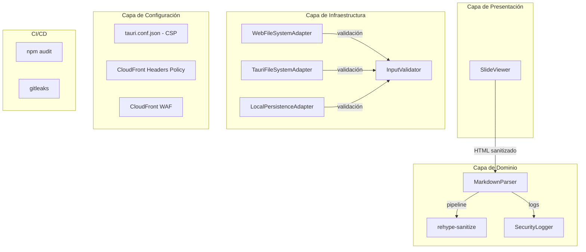
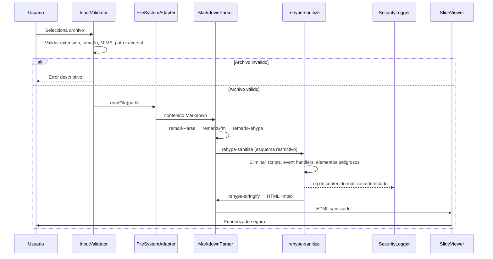

# Documento de Diseño: Pruebas de Seguridad Integrales para Markdown Presenter Pro

## Visión General

Este documento describe el diseño técnico para implementar las medidas de seguridad integrales en Markdown Presenter Pro (MPP). El enfoque principal es mitigar los vectores de ataque XSS existentes en el pipeline de renderizado Markdown, establecer políticas CSP restrictivas para ambos modos de ejecución (Tauri y Web), endurecer la validación de entradas, y automatizar la detección de vulnerabilidades en el pipeline CI/CD.

### Estado Actual y Riesgos Identificados

El análisis del código fuente revela tres vectores de riesgo críticos:

1. **`MarkdownParser.toHtml()`** usa `remarkRehype` con `allowDangerousHtml: true`, permitiendo que HTML embebido en Markdown pase sin sanitización al DOM.
2. **`SlideViewer`** usa `dangerouslySetInnerHTML` para renderizar el HTML generado, confiando completamente en el pipeline.
3. **`tauri.conf.json`** tiene `"csp": null`, deshabilitando toda protección CSP en modo escritorio.

La estrategia de diseño se basa en defensa en profundidad: sanitización en el pipeline (capa de dominio), CSP como segunda barrera (capa de configuración), validación de entradas (capa de infraestructura), y monitoreo automatizado (capa CI/CD).

### Fuentes de Investigación

- [Documentación oficial de rehype-sanitize](https://github.com/rehypejs/rehype-sanitize) — Plugin del ecosistema rehype para sanitización de árboles HTML (hast) basado en esquemas configurables. Usa `hast-util-sanitize` internamente.
- [Documentación de CSP en Tauri](https://tauri.app/security/csp/) — Tauri aplica nonces y hashes automáticamente a scripts y estilos bundleados cuando CSP está habilitado.
- [CloudFront Response Headers Policies](https://dev.to/aws-builders/apply-cloudfront-security-headers-policy-with-terraform-fd3) — AWS soporta nativamente cabeceras de seguridad en CloudFront desde noviembre 2021.
- [Gitleaks GitHub Action](https://github.com/gitleaks/gitleaks-action) — Herramienta de escaneo de secretos integrable en GitHub Actions.

## Arquitectura

La implementación se organiza en cuatro capas siguiendo la arquitectura existente de MPP:



### Flujo de Datos Seguro



## Componentes e Interfaces

### 1. Sanitizador HTML (rehype-sanitize en MarkdownParser)

**Ubicación:** `src/domain/MarkdownParser.ts`

Se integra `rehype-sanitize` en el pipeline existente de `htmlProcessor`, posicionado después de `rehype-highlight` y antes de `rehype-stringify`. Se usa un esquema personalizado basado en `defaultSchema` de `rehype-sanitize` que extiende los elementos permitidos para incluir las clases CSS generadas por `rehype-highlight` (syntax highlighting).

```typescript
import rehypeSanitize, { defaultSchema } from "rehype-sanitize";
import { type Schema } from "hast-util-sanitize";

// Esquema personalizado que preserva syntax highlighting
const sanitizeSchema: Schema = {
  ...defaultSchema,
  attributes: {
    ...defaultSchema.attributes,
    code: [
      ...(defaultSchema.attributes?.code ?? []),
      ["className", /^hljs-/, /^language-/],
    ],
    span: [
      ...(defaultSchema.attributes?.span ?? []),
      ["className", /^hljs-/],
    ],
  },
  tagNames: [
    ...(defaultSchema.tagNames ?? []),
    // Asegurar que los elementos de syntax highlighting se preserven
  ],
};

// Pipeline modificado:
private readonly htmlProcessor = unified()
  .use(remarkParse)
  .use(remarkGfm)
  .use(remarkFrontmatter)
  .use(remarkRehype, { allowDangerousHtml: true })
  .use(rehypeHighlight)
  .use(rehypeSanitize, sanitizeSchema)  // ← NUEVO
  .use(rehypeStringify);
```

**Decisión de diseño:** Se mantiene `allowDangerousHtml: true` en `remarkRehype` para que el HTML embebido legítimo (tablas complejas, etc.) pase al árbol hast donde `rehype-sanitize` puede evaluarlo contra el esquema. Si se deshabilitara, el HTML embebido se escaparía antes de llegar al sanitizador, perdiendo la capacidad de permitir elementos seguros.

### 2. SecurityLogger

**Ubicación:** `src/domain/SecurityLogger.ts`

Componente ligero que registra en consola los intentos de inyección detectados. Se invoca mediante un plugin rehype personalizado que compara el árbol antes y después de la sanitización.

```typescript
export interface SecurityEvent {
  type:
    | "xss_script"
    | "xss_event_handler"
    | "xss_dangerous_url"
    | "xss_dangerous_element"
    | "xss_dangerous_style";
  detail: string;
  timestamp: number;
}

export interface ISecurityLogger {
  log(event: SecurityEvent): void;
  getEvents(): SecurityEvent[];
}
```

### 3. InputValidator

**Ubicación:** `src/infrastructure/InputValidator.ts`

Módulo centralizado de validación que consolida las validaciones dispersas en `WebFileSystemAdapter` y añade nuevas validaciones de seguridad.

```typescript
export interface ValidationResult {
  valid: boolean;
  error?: string;
}

export interface IInputValidator {
  validateFileExtension(filename: string): ValidationResult;
  validateFileSize(sizeBytes: number): ValidationResult;
  validateMimeType(mimeType: string, filename: string): ValidationResult;
  validatePath(path: string): ValidationResult;
  validateFilename(filename: string): ValidationResult;
  validateFileCount(count: number): ValidationResult;
  validateUtf8(content: ArrayBuffer): ValidationResult;
  validateImageUrl(url: string): ValidationResult;
}
```

**Constantes de validación:**

| Parámetro                          | Valor                                            |
| ---------------------------------- | ------------------------------------------------ |
| Extensiones permitidas             | `.md`, `.markdown`, `.txt`                       |
| Tamaño máximo                      | 10 MB (10 _ 1024 _ 1024 bytes)                   |
| MIME types permitidos              | `text/plain`, `text/markdown`, `text/x-markdown` |
| Máximo archivos por carga          | 100                                              |
| Caracteres prohibidos en nombres   | `\0`, ASCII 0-31 (excepto `\t`, `\r`, `\n`)      |
| Secuencias de traversal            | `../`, `..\\`, `%2e%2e`, `%2E%2E`                |
| Esquemas URL permitidos (imágenes) | `https:`, `data:` (solo `image/*`)               |

### 4. LocalPersistenceAdapter (Endurecido)

**Ubicación:** `src/infrastructure/LocalPersistenceAdapter.ts`

Se modifica el adaptador existente para:

- Usar prefijo `mpp_` en todas las claves
- Validar valores contra opciones permitidas antes de retornarlos
- Restringir las claves almacenables a un conjunto conocido

```typescript
const ALLOWED_KEYS = ["theme", "language", "dockPosition"] as const;
const VALID_VALUES: Record<string, string[]> = {
  theme: ["light", "dark"],
  language: ["es", "en"],
  dockPosition: ["top", "bottom", "left", "right"],
};
const NAMESPACE_PREFIX = "mpp_";
```

### 5. Configuración CSP

**Tauri (`src-tauri/tauri.conf.json`):**

```json
{
  "app": {
    "security": {
      "csp": {
        "default-src": "'self'",
        "script-src": "'self'",
        "style-src": "'self' 'unsafe-inline'",
        "img-src": "'self' data: https: asset: http://asset.localhost",
        "font-src": "'self' data:",
        "connect-src": "ipc: http://ipc.localhost",
        "object-src": "'none'",
        "base-uri": "'self'"
      }
    }
  }
}
```

**Decisión de diseño:** `style-src` incluye `'unsafe-inline'` porque Tailwind CSS v4 y Framer Motion inyectan estilos inline dinámicamente. Tauri añade automáticamente nonces a los scripts bundleados, por lo que `script-src: 'self'` es suficiente.

**CloudFront Response Headers Policy:**

Las cabeceras se configuran mediante una Response Headers Policy de CloudFront (no requiere Lambda@Edge). La política incluye:

| Cabecera                    | Valor                                                                                                                                      |
| --------------------------- | ------------------------------------------------------------------------------------------------------------------------------------------ |
| `Content-Security-Policy`   | `default-src 'self'; script-src 'self'; style-src 'self' 'unsafe-inline'; img-src 'self' data: https:; object-src 'none'; base-uri 'self'` |
| `Strict-Transport-Security` | `max-age=31536000; includeSubDomains`                                                                                                      |
| `X-Content-Type-Options`    | `nosniff`                                                                                                                                  |
| `X-Frame-Options`           | `DENY`                                                                                                                                     |
| `Referrer-Policy`           | `strict-origin-when-cross-origin`                                                                                                          |
| `Permissions-Policy`        | `camera=(), microphone=(), geolocation=(), payment=()`                                                                                     |

### 6. CI/CD Security Steps

**Ubicación:** `.github/workflows/ci.yml`

Se añaden dos pasos al job `quality` existente:

```yaml
- name: Security audit
  run: npm audit --audit-level=high

- name: Secret scanning
  uses: gitleaks/gitleaks-action@v2
  env:
    GITHUB_TOKEN: ${{ secrets.GITHUB_TOKEN }}
```

**Decisión de diseño:** Se usa `npm audit --audit-level=high` en lugar de `--audit-level=critical` para capturar también vulnerabilidades de severidad alta. Se usa `gitleaks-action@v2` por ser la herramienta de escaneo de secretos más adoptada en el ecosistema GitHub Actions, con soporte nativo para patrones de AWS, tokens de GitHub, y claves de API comunes.

## Modelos de Datos

### SecurityEvent

```typescript
interface SecurityEvent {
  type:
    | "xss_script"
    | "xss_event_handler"
    | "xss_dangerous_url"
    | "xss_dangerous_element"
    | "xss_dangerous_style";
  detail: string;
  timestamp: number;
}
```

### ValidationResult

```typescript
interface ValidationResult {
  valid: boolean;
  error?: string;
}
```

### SanitizeSchema (configuración de rehype-sanitize)

El esquema extiende `defaultSchema` de `hast-util-sanitize` que sigue el modelo de sanitización de GitHub. Los elementos y atributos no incluidos en el esquema se eliminan automáticamente. Las extensiones principales son:

- `span.className` y `code.className`: patrones `hljs-*` y `language-*` para syntax highlighting
- `img.src`: permite `https:` y `data:image/*`
- Elementos de tabla GFM: `table`, `thead`, `tbody`, `tr`, `th`, `td`

### Claves de LocalStorage

```typescript
type StorageKey = "mpp_theme" | "mpp_language" | "mpp_dockPosition";

interface StorageSchema {
  mpp_theme: "light" | "dark";
  mpp_language: "es" | "en";
  mpp_dockPosition: "top" | "bottom" | "left" | "right";
}
```

## Propiedades de Corrección

_Una propiedad es una característica o comportamiento que debe mantenerse verdadero en todas las ejecuciones válidas de un sistema — esencialmente, una declaración formal sobre lo que el sistema debe hacer. Las propiedades sirven como puente entre especificaciones legibles por humanos y garantías de corrección verificables por máquinas._

### Propiedad 1: Sanitización completa del HTML

_Para cualquier_ string Markdown arbitrario (incluyendo HTML embebido con scripts, event handlers, iframes, objetos, embeds, formularios, URLs con esquema `javascript:`/`vbscript:`/`data:text/html`, y atributos `style` con expresiones ejecutables), el HTML resultante del pipeline de renderizado SHALL contener exclusivamente elementos y atributos permitidos por el esquema de sanitización definido en rehype-sanitize.

**Valida: Requerimientos 1.1, 1.2, 1.3, 1.4, 1.5, 9.1, 9.2, 9.5, 12.1**

### Propiedad 2: Preservación de contenido legítimo

_Para cualquier_ string Markdown que contenga exclusivamente elementos legítimos (encabezados, párrafos, listas, tablas, bloques de código, imágenes con URLs HTTPS, enlaces con URLs HTTPS/HTTP, texto con formato), el HTML resultante del pipeline SHALL preservar la estructura semántica y el contenido textual de todos los elementos.

**Valida: Requerimientos 1.6**

### Propiedad 3: Validación de extensión de archivo

_Para cualquier_ nombre de archivo, el validador SHALL aceptar el archivo si y solo si su extensión (case-insensitive) es `.md`, `.markdown` o `.txt`, y SHALL rechazar con mensaje de error descriptivo cualquier archivo con extensión diferente.

**Valida: Requerimientos 2.1, 2.2**

### Propiedad 4: Validación de tamaño de archivo

_Para cualquier_ archivo con tamaño en bytes, el validador SHALL rechazar el archivo si su tamaño excede 10 MB (10,485,760 bytes), retornando un mensaje que incluya el tamaño máximo permitido y el tamaño del archivo proporcionado.

**Valida: Requerimientos 2.3**

### Propiedad 5: Rechazo de codificación no UTF-8

_Para cualquier_ secuencia de bytes que contenga secuencias no válidas en UTF-8, el validador SHALL rechazar el contenido con un mensaje indicando codificación no soportada.

**Valida: Requerimientos 2.4**

### Propiedad 6: Prevención de traversal de rutas

_Para cualquier_ ruta de archivo (absoluta o relativa, incluyendo `webkitRelativePath`) que contenga secuencias de traversal (`../`, `..\\`, `%2e%2e`, `%2E%2E` y variaciones con encoding), el validador SHALL rechazar la ruta e impedir el acceso al archivo.

**Valida: Requerimientos 8.2, 8.3**

### Propiedad 7: Rechazo de caracteres de control en nombres de archivo

_Para cualquier_ nombre de archivo que contenga caracteres nulos (`\0`) o caracteres de control (códigos ASCII 0-31 excepto `\t` (9), `\r` (13) y `\n` (10)), el validador SHALL rechazar el archivo.

**Valida: Requerimientos 8.4**

### Propiedad 8: Límite de archivos por operación de carga

_Para cualquier_ operación de carga con N archivos donde N > 100, el validador SHALL rechazar la operación completa con un mensaje de error descriptivo, y para N ≤ 100 SHALL permitir la operación.

**Valida: Requerimientos 8.5**

### Propiedad 9: Validación de tipo MIME en modo web

_Para cualquier_ archivo en modo web, el validador SHALL aceptar el archivo si su tipo MIME es `text/plain`, `text/markdown` o `text/x-markdown`, o si su extensión es `.md`, `.markdown` o `.txt` (independientemente del MIME), y SHALL rechazar archivos con MIME incompatible y extensión no soportada.

**Valida: Requerimientos 8.1**

### Propiedad 10: Escapado correcto de bloques de código

_Para cualquier_ bloque de código Markdown (delimitado por triple backtick) que contenga etiquetas HTML que intenten cerrar `<pre><code>` prematuramente, el HTML resultante SHALL mantener todo el contenido dentro del bloque de código escapado, sin permitir inyección de HTML fuera del bloque.

**Valida: Requerimientos 9.3**

### Propiedad 11: Seguridad de frontmatter

_Para cualquier_ archivo Markdown con bloque frontmatter YAML que contenga valores con HTML o JavaScript embebido, el pipeline SHALL tratar el frontmatter como datos estructurados sin renderizar su contenido como HTML en el DOM.

**Valida: Requerimientos 9.4**

### Propiedad 12: Round-trip de almacenamiento local con validación

_Para cualquier_ valor válido de preferencia (tema ∈ {light, dark}, idioma ∈ {es, en}, posición ∈ {top, bottom, left, right}), almacenarlo y luego leerlo SHALL retornar el mismo valor. Para cualquier valor inválido (JSON corrupto, valores fuera de rango, claves no permitidas), la lectura SHALL retornar el valor predeterminado sin error. Todas las claves SHALL usar el prefijo `mpp_`.

**Valida: Requerimientos 7.1, 7.2, 7.3, 7.5**

### Propiedad 13: Registro de intentos de inyección

_Para cualquier_ archivo Markdown que contenga contenido malicioso que sea neutralizado por el sanitizador (scripts, event handlers, elementos peligrosos), el sistema SHALL registrar en consola al menos un evento de seguridad que incluya el tipo de contenido malicioso detectado.

**Valida: Requerimientos 12.5**

### Propiedad 14: Validación HTTPS para recursos externos

_Para cualquier_ URL de imagen embebida en Markdown que use un esquema diferente a `https:` o `data:image/*` (como `http:`, `ftp:`, `file:`), el sistema SHALL rechazar o neutralizar la URL, permitiendo únicamente imágenes con esquema HTTPS o data URIs de tipo imagen.

**Valida: Requerimientos 12.6**

## Manejo de Errores

### Errores de Validación de Entrada

| Escenario                   | Comportamiento      | Mensaje                                                                            |
| --------------------------- | ------------------- | ---------------------------------------------------------------------------------- |
| Extensión no soportada      | Rechazar archivo    | "Tipo de archivo no soportado: {ext}. Solo se aceptan .md, .markdown y .txt"       |
| Tamaño excedido             | Rechazar archivo    | "El archivo excede el tamaño máximo de 10 MB: {nombre} ({tamaño} MB)"              |
| Codificación no UTF-8       | Rechazar archivo    | "El archivo contiene codificación no soportada. Solo se acepta UTF-8"              |
| Archivo vacío               | Mensaje informativo | "El archivo no contiene contenido para presentar"                                  |
| Path traversal detectado    | Rechazar archivo    | "Ruta de archivo no permitida: se detectó una secuencia de traversal"              |
| Caracteres de control       | Rechazar archivo    | "Nombre de archivo contiene caracteres no permitidos"                              |
| Límite de archivos excedido | Rechazar operación  | "Se excedió el límite de 100 archivos por operación ({N} archivos seleccionados)"  |
| MIME incompatible           | Rechazar archivo    | "Tipo de archivo no soportado: {mime}. Solo se aceptan archivos de texto/markdown" |

### Errores de Sanitización

El sanitizador (`rehype-sanitize`) no lanza errores — silenciosamente elimina contenido no permitido. El `SecurityLogger` registra los eventos de sanitización para monitoreo. Si el pipeline completo falla (error en unified.js), se captura en `RenderMarkdownUseCase` y se muestra un mensaje genérico al usuario.

### Errores de Almacenamiento Local

| Escenario                     | Comportamiento                                       |
| ----------------------------- | ---------------------------------------------------- |
| JSON inválido en localStorage | Descartar, log warning, usar valor predeterminado    |
| Valor fuera de rango          | Descartar, log warning, usar valor predeterminado    |
| localStorage no disponible    | Usar `Map` en memoria como fallback transparente     |
| Cuota excedida                | Log warning, continuar con almacenamiento en memoria |

## Estrategia de Testing

### Enfoque Dual: Tests Unitarios + Tests Basados en Propiedades

La suite de seguridad combina dos enfoques complementarios:

1. **Tests basados en propiedades (PBT)** con `fast-check` (ya presente en `devDependencies`): verifican propiedades universales generando cientos de inputs aleatorios. Ideales para sanitización, validación de entradas y almacenamiento local donde el espacio de inputs es grande.

2. **Tests unitarios con ejemplos**: verifican casos específicos, edge cases y configuraciones estáticas. Ideales para verificar CSP, permisos de Tauri, configuración de CI/CD y cabeceras de seguridad.

### Configuración de Property-Based Tests

- **Librería:** `fast-check` v4.7.0 (ya instalada)
- **Iteraciones mínimas:** 100 por propiedad
- **Tag format:** `Feature: security-testing, Property {N}: {título}`
- Cada test de propiedad referencia su propiedad del documento de diseño

### Estructura de Tests

```
src/__tests__/
├── security/
│   ├── sanitization.property.test.ts    # Propiedades 1, 2, 10, 11, 13
│   ├── input-validation.property.test.ts # Propiedades 3, 4, 5, 6, 7, 8, 9, 14
│   ├── local-storage.property.test.ts    # Propiedad 12
│   ├── csp-config.test.ts               # Reqs 3.1-3.6, 5.1-5.4 (smoke tests)
│   ├── ci-security.test.ts              # Reqs 4.1-4.3, 11.1-11.5 (smoke tests)
│   └── security-headers.test.ts         # Reqs 6.1-6.5 (smoke tests)
```

### Tests de Propiedades (PBT)

| Archivo                             | Propiedades             | Descripción                                                                           |
| ----------------------------------- | ----------------------- | ------------------------------------------------------------------------------------- |
| `sanitization.property.test.ts`     | 1, 2, 10, 11, 13        | Sanitización XSS, preservación de contenido, escapado de código, frontmatter, logging |
| `input-validation.property.test.ts` | 3, 4, 5, 6, 7, 8, 9, 14 | Extensiones, tamaño, UTF-8, traversal, caracteres, límite, MIME, HTTPS                |
| `local-storage.property.test.ts`    | 12                      | Round-trip de preferencias, validación de valores, prefijo namespace                  |

### Tests Unitarios (Ejemplos y Smoke)

| Archivo                    | Requerimientos     | Tipo                                                             |
| -------------------------- | ------------------ | ---------------------------------------------------------------- |
| `csp-config.test.ts`       | 3.1-3.6, 5.1-5.4   | SMOKE — Verificar configuración estática de CSP y permisos Tauri |
| `ci-security.test.ts`      | 4.1-4.3, 11.1-11.5 | SMOKE — Verificar que ci.yml contenga pasos de audit y gitleaks  |
| `security-headers.test.ts` | 6.1-6.5            | SMOKE — Verificar definición de cabeceras de seguridad           |

### Criterios No Testeables Automáticamente

Los siguientes requerimientos requieren verificación manual o de infraestructura:

- **Req 3.7, 6.6, 6.7**: Configuración de CloudFront (verificación en AWS Console)
- **Req 5.5**: Documentación de permisos en PR (proceso de revisión)
- **Req 7.4**: Fallback a memoria cuando localStorage no disponible (test de ejemplo, no propiedad)
- **Req 10.1-10.4**: Configuración de WAF (verificación en AWS Console)
- **Req 2.5, 2.6**: Archivos vacíos y secciones malformadas (tests de ejemplo específicos)
