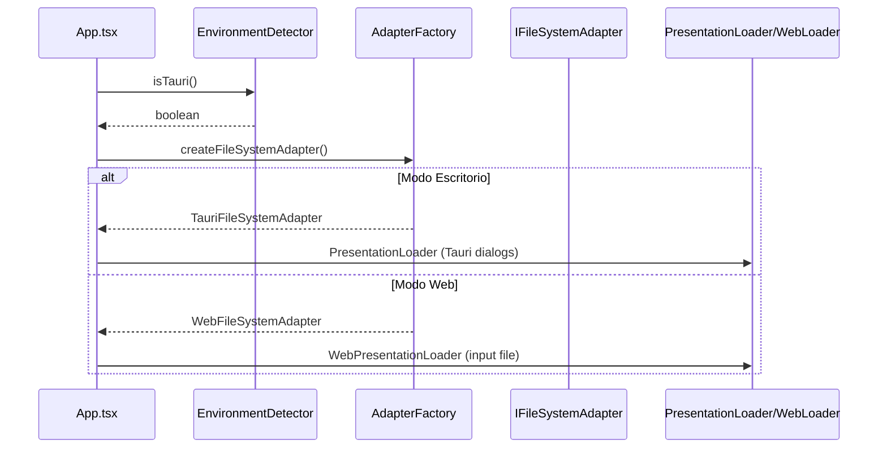

# Documento de Diseño: Despliegue Web de Markdown Presenter Pro

## Visión General

Este diseño habilita la operación dual de MPP: como aplicación de escritorio (Tauri) y como aplicación web estática desplegable en navegador. La arquitectura existente basada en Clean Architecture con interfaces de adaptadores (`IFileSystemAdapter`, `IPersistenceAdapter`) facilita esta transición — solo se necesitan implementaciones alternativas para el entorno del navegador, un detector de entorno, y una fábrica de adaptadores.

La versión web se despliega en AWS usando S3 (hosting estático) + CloudFront (CDN con HTTPS), dentro de los límites del Free Tier de AWS. El build web se genera con Vite usando una variable de entorno `VITE_BUILD_TARGET=web` que excluye dependencias de Tauri mediante tree-shaking y externals.

### Decisiones Arquitectónicas Clave

| Decisión                 | Elección                                            | Justificación                                                                                   |
| ------------------------ | --------------------------------------------------- | ----------------------------------------------------------------------------------------------- |
| Detección de entorno     | `window.__TAURI_INTERNALS__`                        | Verificación síncrona, sin dependencias externas, disponible antes de cualquier import dinámico |
| Adaptador FS web         | Browser File API + `FileReader`                     | API estándar del navegador, sin dependencias, compatible con drag & drop existente              |
| Selector de archivos web | `<input type="file">` oculto                        | Patrón estándar para selección de archivos en web, soporta `accept` y `webkitdirectory`         |
| Fábrica de adaptadores   | Función `createAdapters()` con detección de entorno | Centraliza la lógica de creación, elimina imports dinámicos dispersos en `App.tsx`              |
| Build web                | Variable de entorno `VITE_BUILD_TARGET`             | Reutiliza `vite.config.ts` existente con condicionales, evita archivo de config duplicado       |
| Hosting AWS              | S3 + CloudFront (Free Tier)                         | S3 5GB almacenamiento + CloudFront 1TB transferencia/mes, HTTPS incluido, sin costo             |
| CI/CD web                | Job adicional en GitHub Actions existente           | Reutiliza pipeline CI/CD, despliega automáticamente en push a `main`                            |

## Arquitectura

### Diagrama de Arquitectura Dual (Tauri + Web)

```mermaid
graph TB
    subgraph "Capa de Presentación (UI)"
        UI_Loader[PresentationLoader]
        UI_WebLoader[WebPresentationLoader]
        UI_Slide[SlideViewer]
        UI_Nav[LinearNavigator]
        UI_Dock[FloatingDock]
        UI_Presenter[PresenterMode]
        UI_Badge[WebModeBadge]
    end

    subgraph "Capa de Aplicación"
        UC_Load[LoadPresentationUseCase]
        UC_Navigate[NavigateSlideUseCase]
        UC_Render[RenderMarkdownUseCase]
        UC_Config[ConfigurationUseCase]
    end

    subgraph "Capa de Infraestructura"
        ENV[EnvironmentDetector]
        FACTORY[AdapterFactory]

        subgraph "Adaptadores Tauri"
            TAURI_FS[TauriFileSystemAdapter]
            TAURI_DIALOG["Tauri Dialog API"]
        end

        subgraph "Adaptadores Web"
            WEB_FS[WebFileSystemAdapter]
            WEB_INPUT["&lt;input type=file&gt;"]
        end

        PERSIST[LocalPersistenceAdapter]
    end

    subgraph "AWS Hosting"
        S3[S3 Bucket]
        CF[CloudFront CDN]
    end

    ENV --> FACTORY
    FACTORY -->|Modo_Escritorio| TAURI_FS
    FACTORY -->|Modo_Escritorio| TAURI_DIALOG
    FACTORY -->|Modo_Web| WEB_FS
    FACTORY -->|Modo_Web| WEB_INPUT

    UI_Loader -->|Modo_Escritorio| TAURI_DIALOG
    UI_WebLoader -->|Modo_Web| WEB_INPUT
    UC_Load --> TAURI_FS
    UC_Load --> WEB_FS

    CF --> S3
```



### Flujo de Inicialización



### Flujo de Carga de Archivos en Modo Web

```mermaid
sequenceDiagram
    participant User as Usuario
    participant WL as WebPresentationLoader
    participant Input as &lt;input type=file&gt;
    participant WFS as WebFileSystemAdapter
    participant UC as LoadPresentationUseCase

    User->>WL: click "Abrir archivo"
    WL->>Input: trigger click (accept=".md")
    Input-->>WL: File object
    WL->>WFS: setFiles([File])
    WL->>UC: execute({path: file.name, type: "file"})
    UC->>WFS: readFile(file.name)
    WFS-->>UC: contenido string
    UC-->>WL: LoadPresentationResult
```

## Componentes e Interfaces

### Detector de Entorno (`EnvironmentDetector`)

Módulo utilitario que determina el entorno de ejecución de forma síncrona. Verifica la presencia de `window.__TAURI_INTERNALS__` que Tauri inyecta en el contexto global.

```typescript
// src/infrastructure/EnvironmentDetector.ts

/**
 * Detecta si MPP se ejecuta dentro de Tauri o en un navegador web.
 * Verificación síncrona basada en la presencia de APIs inyectadas por Tauri.
 */
export function isTauri(): boolean {
  return typeof window !== "undefined" && "__TAURI_INTERNALS__" in window;
}

export type RuntimeEnvironment = "tauri" | "web";

export function getEnvironment(): RuntimeEnvironment {
  return isTauri() ? "tauri" : "web";
}
```

### WebFileSystemAdapter

Implementación de `IFileSystemAdapter` para el navegador. Opera sobre objetos `File` del browser en lugar de rutas del sistema de archivos. Mantiene un `Map<string, File>` interno que se puebla cuando el usuario selecciona archivos.

```typescript
// src/infrastructure/WebFileSystemAdapter.ts

import type { IFileSystemAdapter, FileEntry } from "./IFileSystemAdapter";

/**
 * Adaptador de sistema de archivos para navegador web.
 * Usa la API File del browser para leer archivos seleccionados por el usuario.
 *
 * Patrón Adapter: traduce la API File del navegador a IFileSystemAdapter.
 * Los archivos se cargan en memoria mediante setFiles() antes de ser leídos.
 */
export class WebFileSystemAdapter implements IFileSystemAdapter {
  /** Mapa de nombre/ruta relativa → objeto File del navegador */
  private files: Map<string, File> = new Map();

  /**
   * Registra archivos seleccionados por el usuario para lectura posterior.
   * Se invoca desde WebPresentationLoader al seleccionar archivos o carpetas.
   */
  setFiles(fileList: FileList | File[]): void {
    this.files.clear();
    for (const file of Array.from(fileList)) {
      // webkitRelativePath contiene la ruta relativa dentro de la carpeta
      const key = file.webkitRelativePath || file.name;
      this.files.set(key, file);
    }
  }

  async readFile(path: string): Promise<string> {
    const file = this.files.get(path);
    if (!file) {
      throw new Error(`Archivo no encontrado: ${path}`);
    }

    // Validar tipo de archivo
    if (!this.isTextFile(file)) {
      throw new Error(
        `Tipo de archivo no soportado: ${file.type}. Solo se aceptan archivos de texto (.md, .txt, .markdown).`
      );
    }

    // Validar tamaño (máximo 10 MB)
    const MAX_SIZE = 10 * 1024 * 1024;
    if (file.size > MAX_SIZE) {
      throw new Error(
        `El archivo excede el tamaño máximo de 10 MB: ${file.name} (${(file.size / 1024 / 1024).toFixed(1)} MB)`
      );
    }

    return file.text();
  }

  async readDirectory(path: string): Promise<FileEntry[]> {
    const entries: FileEntry[] = [];
    for (const [key, file] of this.files.entries()) {
      // Filtrar archivos que pertenecen al directorio solicitado
      const relativePath = file.webkitRelativePath || file.name;
      if (this.isInDirectory(relativePath, path)) {
        const name = file.name;
        const ext = name.includes(".") ? `.${name.split(".").pop()}` : "";
        entries.push({
          name,
          path: key,
          isDirectory: false,
          extension: ext,
        });
      }
    }
    return entries.sort((a, b) => a.name.localeCompare(b.name));
  }

  async exists(path: string): Promise<boolean> {
    return this.files.has(path);
  }

  /** Obtiene la lista de archivos cargados actualmente */
  getLoadedFiles(): Map<string, File> {
    return new Map(this.files);
  }

  /** Limpia los archivos cargados */
  clear(): void {
    this.files.clear();
  }

  private isTextFile(file: File): boolean {
    const textTypes = ["text/plain", "text/markdown", "text/x-markdown"];
    const mdExtensions = [".md", ".markdown", ".txt"];
    return (
      textTypes.includes(file.type) ||
      mdExtensions.some((ext) => file.name.toLowerCase().endsWith(ext)) ||
      file.type === "" // Algunos navegadores no asignan MIME a .md
    );
  }

  private isInDirectory(filePath: string, dirPath: string): boolean {
    if (!dirPath || dirPath === "" || dirPath === ".") return true;
    return filePath.startsWith(dirPath);
  }
}
```

### WebPresentationLoader

Componente React que reemplaza los diálogos nativos de Tauri con elementos `<input type="file">` del navegador. Reutiliza la misma interfaz visual que `PresentationLoader` pero con mecanismos de selección web.

```typescript
// src/presentation/WebPresentationLoader.tsx

interface WebPresentationLoaderProps {
  /** Callback cuando se cargan archivos exitosamente */
  onLoad: (path: string, type: "file" | "directory") => void;
  /** Referencia al WebFileSystemAdapter para registrar archivos */
  webFs: WebFileSystemAdapter;
  /** Si está cargando actualmente */
  isLoading: boolean;
  /** Mensaje de error si la carga falló */
  error: string | null;
}

/**
 * Componente de carga para Modo Web.
 *
 * Usa <input type="file"> ocultos para selección de archivos y carpetas.
 * Soporta:
 * - Selección de archivo .md individual (accept=".md,.markdown")
 * - Selección de carpeta (webkitdirectory)
 * - Selección múltiple de archivos .md
 * - Drag & drop de archivos y carpetas
 * - Detección de soporte webkitdirectory
 */
const WebPresentationLoader: React.FC<WebPresentationLoaderProps>;
```

Comportamiento clave:

- El input de archivo usa `accept=".md,.markdown"` para filtrar archivos Markdown
- El input de carpeta usa el atributo `webkitdirectory` para selección de directorios
- Si `webkitdirectory` no está soportado, el botón "Abrir carpeta" se oculta y se muestra un mensaje informativo
- El drag & drop existente se extiende para leer contenido via `File API` en lugar de solo pasar el nombre

### Fábrica de Adaptadores (`AdapterFactory`)

Centraliza la creación de adaptadores según el entorno detectado. Elimina la lógica de imports dinámicos dispersa en `App.tsx`.

```typescript
// src/infrastructure/AdapterFactory.ts

import type { IFileSystemAdapter } from "./IFileSystemAdapter";
import { isTauri } from "./EnvironmentDetector";
import { WebFileSystemAdapter } from "./WebFileSystemAdapter";

export interface AdapterSet {
  fileSystem: IFileSystemAdapter;
  isWeb: boolean;
  /** Solo disponible en modo web — referencia para registrar archivos */
  webFileSystem?: WebFileSystemAdapter;
}

/**
 * Crea el conjunto de adaptadores apropiado según el entorno de ejecución.
 *
 * En Modo Escritorio: usa import dinámico para TauriFileSystemAdapter
 * (evita que Vite incluya dependencias de Tauri en el bundle web).
 *
 * En Modo Web: instancia WebFileSystemAdapter directamente.
 */
export async function createAdapters(): Promise<AdapterSet> {
  if (isTauri()) {
    const { TauriFileSystemAdapter } = await import("./TauriFileSystemAdapter");
    return {
      fileSystem: new TauriFileSystemAdapter(),
      isWeb: false,
    };
  }

  const webFs = new WebFileSystemAdapter();
  return {
    fileSystem: webFs,
    isWeb: true,
    webFileSystem: webFs,
  };
}
```

### Componente WebModeBadge

Indicador visual sutil que muestra "Web" cuando MPP se ejecuta en modo navegador.

```typescript
// src/presentation/WebModeBadge.tsx

interface WebModeBadgeProps {
  className?: string;
}

/**
 * Badge sutil que indica el modo de ejecución web.
 * Se muestra en la esquina inferior izquierda de la interfaz.
 * Solo visible en Modo Web.
 */
const WebModeBadge: React.FC<WebModeBadgeProps>;
```

### Modificaciones a App.tsx

`App.tsx` se modifica para usar `AdapterFactory` en lugar de imports dinámicos directos de Tauri:

```typescript
// Cambios principales en App.tsx:

// 1. Estado para adaptadores
const [adapters, setAdapters] = useState<AdapterSet | null>(null);

// 2. Inicialización con factory
useEffect(() => {
  createAdapters().then(setAdapters);
}, []);

// 3. handleLoad usa adapters.fileSystem en lugar de import dinámico
const handleLoad = useCallback(async (path: string, type: "file" | "directory") => {
  if (!adapters) return;
  dispatch({ type: "LOAD_START" });
  const useCase = new LoadPresentationUseCase(
    adapters.fileSystem, parser, iconResolver
  );
  const result = await useCase.execute({ path, type });
  // ...
}, [adapters]);

// 4. Renderizado condicional del loader
{adapters?.isWeb ? (
  <WebPresentationLoader
    onLoad={handleLoad}
    webFs={adapters.webFileSystem!}
    isLoading={isLoading}
    error={error}
  />
) : (
  <PresentationLoader onLoad={handleLoad} isLoading={isLoading} error={error} />
)}

// 5. Badge de modo web
{adapters?.isWeb && <WebModeBadge />}
```

### Configuración de Build Web

Se extiende `vite.config.ts` para soportar el build web mediante la variable de entorno `VITE_BUILD_TARGET`:

```typescript
// vite.config.ts (modificado)

import { defineConfig } from "vite";
import react from "@vitejs/plugin-react";
import tailwindcss from "@tailwindcss/vite";
import path from "path";

const isWebBuild = process.env.VITE_BUILD_TARGET === "web";

export default defineConfig({
  plugins: [react(), tailwindcss()],
  resolve: {
    alias: {
      "@": path.resolve(__dirname, "./src"),
    },
  },
  build: {
    outDir: isWebBuild ? "dist-web" : "dist",
    rollupOptions: isWebBuild
      ? {
          external: [
            "@tauri-apps/api",
            "@tauri-apps/plugin-fs",
            "@tauri-apps/plugin-dialog",
          ],
        }
      : undefined,
  },
  clearScreen: false,
  server: {
    port: 1420,
    strictPort: true,
    watch: {
      ignored: ["**/src-tauri/**"],
    },
  },
});
```

Script en `package.json`:

```json
{
  "scripts": {
    "build:web": "VITE_BUILD_TARGET=web tsc && VITE_BUILD_TARGET=web vite build"
  }
}
```

### Infraestructura AWS (S3 + CloudFront)

Configuración de hosting estático dentro del Free Tier de AWS:

**Bucket S3:**

- Nombre: `mpp-web-app` (o similar único)
- Acceso público: bloqueado
- Acceso: solo via CloudFront OAC (Origin Access Control)
- Contenido: artefactos de `dist-web/`

**Distribución CloudFront:**

- Origen: bucket S3 con OAC
- HTTPS: certificado predeterminado de CloudFront (`*.cloudfront.net`)
- Comportamiento de caché:
  - `index.html`: `Cache-Control: max-age=0, must-revalidate`
  - `assets/*` (JS, CSS con hash): `Cache-Control: max-age=31536000, immutable`
- Página de error personalizada: `403` y `404` → `/index.html` (soporte SPA)
- Compresión: habilitada (gzip, brotli)

**Límites Free Tier:**

- S3: 5 GB almacenamiento, 20,000 GET requests/mes
- CloudFront: 1 TB transferencia/mes, 10,000,000 requests/mes

### CI/CD: Job de Despliegue Web

Se agrega un job `web-deploy` al pipeline existente en `.github/workflows/ci.yml`:

```yaml
# Job adicional en ci.yml
web-deploy:
  name: Web Build & Deploy
  runs-on: ubuntu-latest
  needs: quality
  if: github.ref == 'refs/heads/main'

  steps:
    - uses: actions/checkout@v4

    - name: Setup Node.js
      uses: actions/setup-node@v4
      with:
        node-version: ${{ env.NODE_VERSION }}
        cache: "npm"

    - name: Install dependencies
      run: npm ci

    - name: Build web version
      run: npm run build:web

    - name: Configure AWS credentials
      uses: aws-actions/configure-aws-credentials@v4
      with:
        aws-access-key-id: ${{ secrets.AWS_ACCESS_KEY_ID }}
        aws-secret-access-key: ${{ secrets.AWS_SECRET_ACCESS_KEY }}
        aws-region: us-east-1

    - name: Deploy to S3
      run: aws s3 sync dist-web/ s3://${{ secrets.S3_BUCKET_NAME }} --delete

    - name: Invalidate CloudFront cache
      run: |
        aws cloudfront create-invalidation \
          --distribution-id ${{ secrets.CLOUDFRONT_DISTRIBUTION_ID }} \
          --paths "/index.html"
```

### Degradación Elegante

Manejo de limitaciones del modo web:

| Limitación                               | Estrategia                                                        |
| ---------------------------------------- | ----------------------------------------------------------------- |
| Sin acceso al sistema de archivos nativo | `WebFileSystemAdapter` con File API                               |
| `webkitdirectory` no soportado           | Ocultar botón carpeta, ofrecer selección múltiple                 |
| Imágenes con rutas absolutas locales     | Mostrar placeholder con mensaje informativo                       |
| Imágenes con URLs remotas                | Funcionan normalmente via ``                             |
| Funcionalidades exclusivas de escritorio | Mensaje informativo al intentar acceder                           |
| localStorage no disponible               | Fallback a memoria (ya implementado en `LocalPersistenceAdapter`) |

## Modelos de Datos

### Estado de Adaptadores

```typescript
/** Resultado de la fábrica de adaptadores */
interface AdapterSet {
  fileSystem: IFileSystemAdapter;
  isWeb: boolean;
  webFileSystem?: WebFileSystemAdapter;
}
```

### Estado del WebFileSystemAdapter

```typescript
/** Estado interno del adaptador web de archivos */
// Map<string, File> donde:
// - key: webkitRelativePath (carpeta) o file.name (archivo individual)
// - value: objeto File del navegador
```

### Configuración de Build

```typescript
/** Variables de entorno para el build */
interface BuildEnvironment {
  VITE_BUILD_TARGET: "web" | "tauri" | undefined;
}
```

### Configuración AWS

```typescript
/** Configuración conceptual de la infraestructura AWS */
interface AWSHostingConfig {
  s3: {
    bucketName: string;
    region: string;
    publicAccess: false;
    accessControl: "OAC"; // Origin Access Control
  };
  cloudfront: {
    distributionId: string;
    defaultRootObject: "index.html";
    errorPages: {
      errorCode: 403 | 404;
      responsePagePath: "/index.html";
      responseCode: 200;
    }[];
    cachePolicy: {
      indexHtml: "max-age=0, must-revalidate";
      hashedAssets: "max-age=31536000, immutable";
    };
    compress: true;
  };
}
```

### Secrets de GitHub Actions

```typescript
/** Secrets requeridos en el repositorio de GitHub */
interface GitHubSecrets {
  AWS_ACCESS_KEY_ID: string;
  AWS_SECRET_ACCESS_KEY: string;
  S3_BUCKET_NAME: string;
  CLOUDFRONT_DISTRIBUTION_ID: string;
}
```

## Propiedades de Correctitud

_Una propiedad es una característica o comportamiento que debe mantenerse verdadero en todas las ejecuciones válidas de un sistema — esencialmente, una declaración formal sobre lo que el sistema debe hacer. Las propiedades sirven como puente entre especificaciones legibles por humanos y garantías de correctitud verificables por máquinas._

### Propiedad 1: Correctitud de la detección de entorno

_Para cualquier_ objeto `window` con o sin la propiedad `__TAURI_INTERNALS__`, la función `isTauri()` SHALL retornar `true` si y solo si `window.__TAURI_INTERNALS__` está presente, y `false` en caso contrario.

**Valida: Requerimiento 1.1**

### Propiedad 2: Round-trip de lectura de archivos web

_Para cualquier_ contenido de texto válido y cualquier nombre de archivo con extensión `.md`, crear un objeto `File` con ese contenido, registrarlo en `WebFileSystemAdapter` mediante `setFiles()`, y luego invocar `readFile()` con la ruta relativa correspondiente SHALL retornar exactamente el mismo contenido de texto original.

**Valida: Requerimientos 2.2, 7.4**

### Propiedad 3: Correctitud de metadatos y ordenamiento en readDirectory

_Para cualquier_ conjunto de objetos `File` con nombres y extensiones variados registrados en `WebFileSystemAdapter`, invocar `readDirectory()` SHALL retornar un arreglo de `FileEntry` donde cada entrada tiene el nombre, ruta, extensión y `isDirectory` correctos, y el arreglo SHALL estar ordenado alfabéticamente por nombre de archivo.

**Valida: Requerimientos 2.3, 3.6**

### Propiedad 4: Correctitud de verificación de existencia

_Para cualquier_ conjunto de archivos registrados en `WebFileSystemAdapter` y cualquier cadena de ruta, `exists()` SHALL retornar `true` si y solo si la ruta corresponde a un archivo previamente registrado mediante `setFiles()`, y `false` para cualquier ruta no registrada.

**Valida: Requerimiento 2.4**

### Propiedad 5: Rechazo de archivos no soportados

_Para cualquier_ objeto `File` cuyo tipo MIME no sea de texto y cuya extensión no sea `.md`, `.markdown` ni `.txt`, invocar `readFile()` en `WebFileSystemAdapter` SHALL lanzar un error con un mensaje descriptivo indicando los tipos de archivo soportados.

**Valida: Requerimiento 2.5**

## Manejo de Errores

### Estrategia General

El manejo de errores extiende la estrategia existente de degradación elegante de MPP, añadiendo escenarios específicos del modo web:

| Nivel       | Comportamiento               | Ejemplo                                                     |
| ----------- | ---------------------------- | ----------------------------------------------------------- |
| Recuperable | Mostrar fallback y continuar | `webkitdirectory` no soportado → ofrecer selección múltiple |
| Informativo | Mostrar mensaje al usuario   | Imagen local con ruta absoluta → placeholder informativo    |
| Fatal       | Mostrar pantalla de error    | Fallo de inicialización de adaptadores                      |

### Errores por Componente

#### EnvironmentDetector

| Escenario                                     | Comportamiento                           |
| --------------------------------------------- | ---------------------------------------- |
| `window` no definido (SSR)                    | `isTauri()` retorna `false`              |
| `__TAURI_INTERNALS__` parcialmente disponible | Retorna `true` (presencia es suficiente) |

#### WebFileSystemAdapter

| Escenario                                | Comportamiento                                             |
| ---------------------------------------- | ---------------------------------------------------------- |
| `readFile` con ruta no registrada        | Lanzar `Error` con mensaje "Archivo no encontrado: {path}" |
| Archivo con tipo MIME no soportado       | Lanzar `Error` con mensaje descriptivo de tipos soportados |
| Archivo mayor a 10 MB                    | Lanzar `Error` con tamaño del archivo y límite máximo      |
| `readDirectory` sin archivos registrados | Retornar arreglo vacío                                     |
| `FileReader` falla al leer               | Propagar error con contexto adicional                      |

#### WebPresentationLoader

| Escenario                            | Comportamiento                                             |
| ------------------------------------ | ---------------------------------------------------------- |
| `webkitdirectory` no soportado       | Ocultar botón "Abrir carpeta", mostrar mensaje informativo |
| Usuario cancela diálogo de selección | No hacer nada (sin error)                                  |
| Archivo seleccionado no es `.md`     | Mostrar error descriptivo                                  |
| Drag & drop de archivo no `.md`      | Ignorar archivo, mostrar mensaje                           |

#### AdapterFactory

| Escenario                      | Comportamiento                                             |
| ------------------------------ | ---------------------------------------------------------- |
| Import dinámico de Tauri falla | Fallback a WebFileSystemAdapter con advertencia en consola |
| Error inesperado en creación   | Propagar error para que App.tsx muestre pantalla de error  |

#### Imágenes en Modo Web

| Escenario                                              | Comportamiento                                                          |
| ------------------------------------------------------ | ----------------------------------------------------------------------- |
| Imagen con ruta absoluta local (`/home/...`, `C:\...`) | Mostrar placeholder con texto: "Imagen local no disponible en modo web" |
| Imagen con URL remota (HTTP/HTTPS)                     | Renderizar normalmente via ``                                  |
| Imagen con ruta relativa                               | Intentar resolver; si falla, mostrar placeholder                        |

#### Despliegue AWS

| Escenario                           | Comportamiento                                                      |
| ----------------------------------- | ------------------------------------------------------------------- |
| Credenciales AWS inválidas en CI/CD | Job falla con mensaje claro, no afecta otros jobs                   |
| S3 sync falla                       | Job falla, artefactos anteriores permanecen en S3                   |
| Invalidación de CloudFront falla    | Job falla con advertencia, caché se actualiza eventualmente por TTL |

## Estrategia de Pruebas

### Enfoque Dual: Pruebas Unitarias + Pruebas Basadas en Propiedades

La estrategia de pruebas combina dos enfoques complementarios, consistente con el diseño original de MPP:

1. **Pruebas unitarias (example-based)**: Verifican comportamientos específicos con ejemplos concretos, casos borde y condiciones de error.
2. **Pruebas basadas en propiedades (property-based)**: Verifican propiedades universales que deben cumplirse para todas las entradas válidas.

### Biblioteca de Pruebas Basadas en Propiedades

- **Biblioteca**: [fast-check](https://github.com/dubzzz/fast-check) (ya instalada en el proyecto)
- **Framework de pruebas**: Vitest (ya configurado)
- **Configuración mínima**: 100 iteraciones por propiedad (`numRuns: 100`)

### Mapeo de Propiedades a Pruebas

| Propiedad                                  | Tipo de Prueba | Generadores Necesarios                                                                |
| ------------------------------------------ | -------------- | ------------------------------------------------------------------------------------- |
| P1: Detección de entorno                   | Property-based | Generador de objetos window-like con/sin `__TAURI_INTERNALS__`                        |
| P2: Round-trip lectura archivos            | Property-based | `fc.string()` para contenido + `fc.string()` para nombres de archivo `.md`            |
| P3: Metadatos y ordenamiento readDirectory | Property-based | Generador de conjuntos de `File` con nombres y extensiones variados                   |
| P4: Verificación de existencia             | Property-based | Generador de conjuntos de archivos + rutas de consulta (registradas y no registradas) |
| P5: Rechazo de archivos no soportados      | Property-based | Generador de `File` con tipos MIME no-texto y extensiones no-markdown                 |

### Formato de Etiquetado de Pruebas de Propiedades

Cada prueba basada en propiedades debe incluir un comentario de etiqueta:

```typescript
// Feature: web-deployment, Property 1: Correctitud de la detección de entorno
it.prop([windowArb], { numRuns: 100 })(
  "isTauri() retorna true iff __TAURI_INTERNALS__ presente",
  (windowObj) => {
    // ...
  }
);
```

### Pruebas Unitarias (Example-Based)

| Área                                        | Casos de Prueba                                          |
| ------------------------------------------- | -------------------------------------------------------- |
| Factory modo escritorio (1.2)               | Mock isTauri()=true, verificar TauriFileSystemAdapter    |
| Factory modo web (1.3)                      | Mock isTauri()=false, verificar WebFileSystemAdapter     |
| isTauri() es síncrono (1.4)                 | Verificar retorno inmediato de boolean                   |
| Input file acepta .md (3.1)                 | Verificar atributo `accept=".md,.markdown"`              |
| Input carpeta webkitdirectory (3.2)         | Verificar atributo `webkitdirectory`                     |
| Drag & drop archivo .md (3.3)               | Simular drop, verificar callback onLoad                  |
| Drag & drop carpeta (3.4)                   | Simular drop con DataTransfer, verificar carga           |
| webkitdirectory no soportado (3.5, 7.3)     | Mock sin soporte, verificar botón oculto y mensaje       |
| Funcionalidades existentes en web (4.1-4.6) | Verificar que componentes existentes funcionan sin Tauri |
| Fullscreen API (4.7)                        | Simular F11, verificar requestFullscreen()               |
| Badge modo web (7.1)                        | Verificar WebModeBadge visible en modo web               |
| Mensaje funcionalidad escritorio (7.2)      | Intentar acción exclusiva, verificar mensaje             |
| Placeholder imágenes locales (7.5)          | Markdown con ruta absoluta, verificar placeholder        |
| Imágenes remotas (7.6)                      | Markdown con URL HTTP, verificar renderizado             |

### Pruebas de Integración / Smoke

| Área                                | Estrategia                                               |
| ----------------------------------- | -------------------------------------------------------- |
| Build web sin Tauri (5.1, 5.3)      | Ejecutar `build:web`, verificar bundle sin `@tauri-apps` |
| Script build:web existe (5.2)       | Verificar package.json                                   |
| Output en dist-web (5.4)            | Verificar directorio de salida                           |
| index.html generado (5.5)           | Verificar existencia del archivo                         |
| Tiempo de build < 60s (5.6)         | Benchmark del proceso de build                           |
| Tamaño bundle < 500KB gzip (5.7)    | Medir tamaño comprimido                                  |
| Rendimiento lectura 10MB (2.6)      | Benchmark con archivo grande                             |
| TTI < 3s en 4G (8.1)                | Lighthouse audit post-despliegue                         |
| Lectura + renderizado < 300ms (8.2) | Benchmark con archivo 1000 líneas                        |
| Transición < 100ms (8.3)            | Benchmark de navegación                                  |
| Code splitting (8.4)                | Verificar múltiples chunks en output                     |

### Estructura de Archivos de Pruebas

```
src/
├── infrastructure/
│   ├── __tests__/
│   │   ├── EnvironmentDetector.test.ts     # Propiedad P1 + unitarias
│   │   ├── WebFileSystemAdapter.test.ts    # Propiedades P2, P3, P4, P5 + unitarias
│   │   └── AdapterFactory.test.ts          # Unitarias (1.2, 1.3)
│   └── ...
├── presentation/
│   ├── __tests__/
│   │   ├── WebPresentationLoader.test.tsx  # Unitarias (3.1-3.5)
│   │   └── WebModeBadge.test.tsx           # Unitarias (7.1)
│   └── ...
└── __tests__/
    ├── generators/
    │   ├── webFile.gen.ts                  # Generador de File objects para PBT
    │   └── ...
    └── integration/
        ├── webBuild.test.ts                # Smoke tests del build web
        └── ...
```
